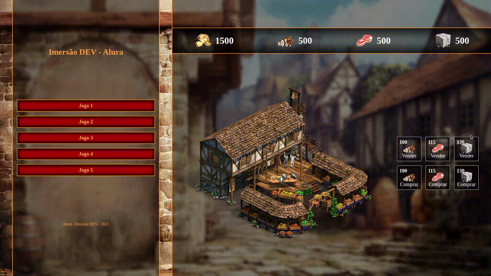
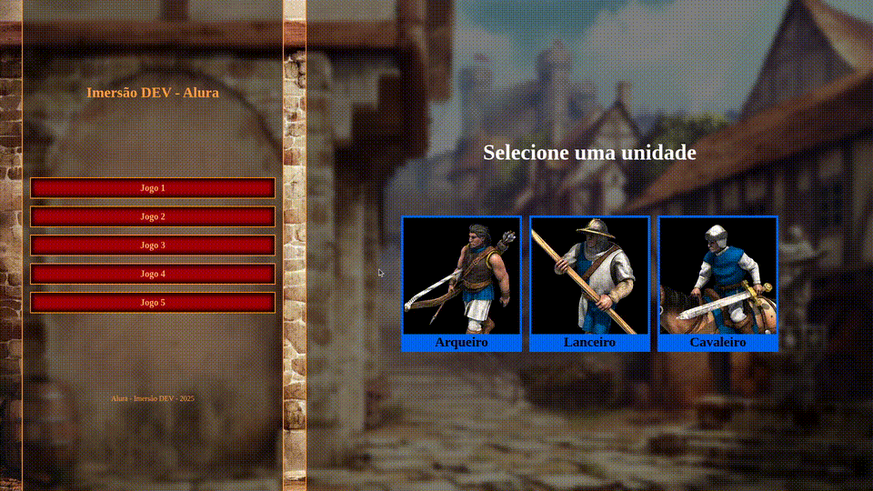
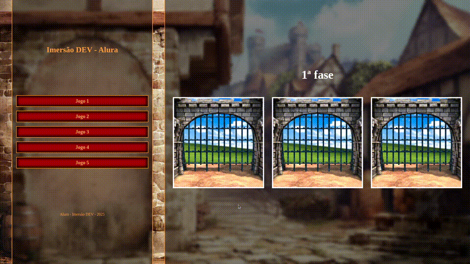
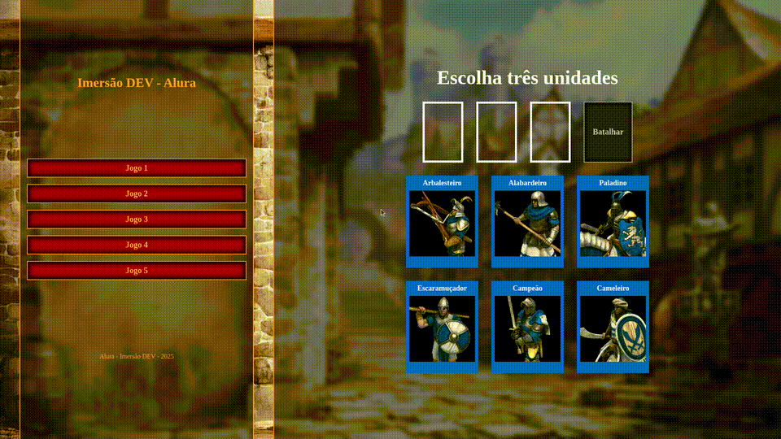
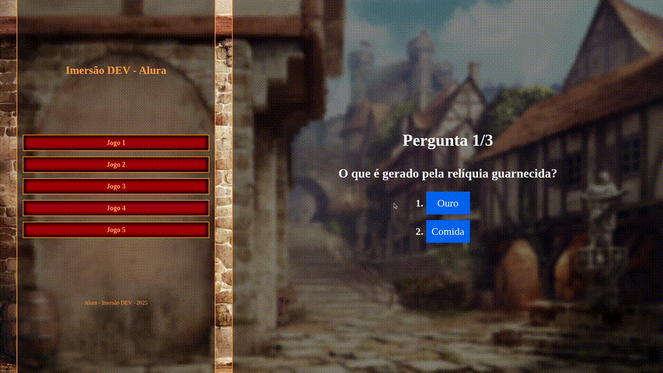

<h1 align="center">Imersão DEV 9 - Alura</h1>
  
Projeto com 5 jogos com tema do Age of Empires II: Definitive Edition

<h2>Tecnologias</h2>
  <ul>
    <li>HTML</li>
    <li>CSS</li>
    <li>JavaScript</li>
  </ul>

<h2>Jogo 1</h2>
  <i>Mercado onde pode comprar e vender recursos.</i>
  

<h2>Jogo 2</h2>
  <i>Escolha uma dentre três unidades e batalhe contra o computador.</i>
  

<h2>Jogo 3</h2>
  <i>Escolha o portão correto para avançar até chegar a relíquia.</i>
  

<h2>Jogo 4</h2>
  <i>Selecione três unidades e batalhe contra o computador.</i>
  

<h2>Jogo 5</h2>
  <i>Quiz com perguntas relacionadas ao Age of Empires II.</i>
  
